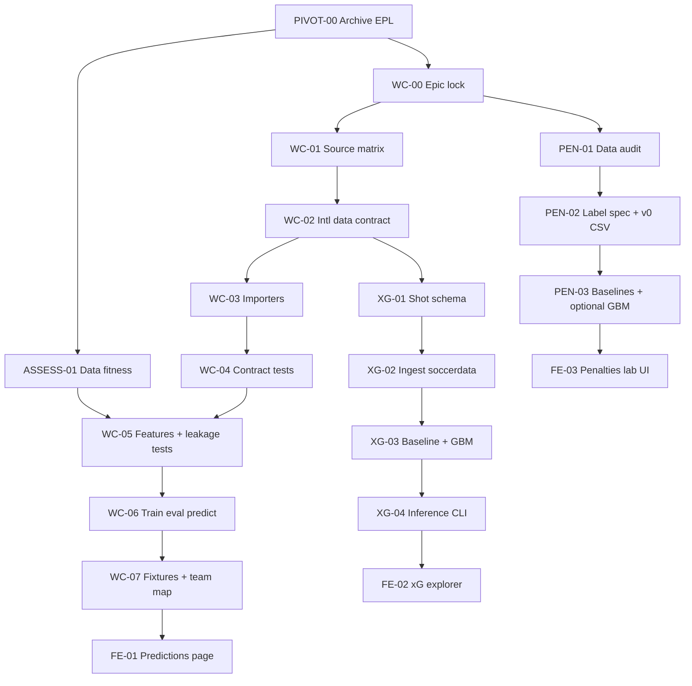

# World Cup 2026 — Handoff Roadmap

Operational plan for three tracks. Each **ticket** below is one agent session (Cursor, Claude Code, etc.).

## Pivot strategy (read first)

This repo **pivots to international / World Cup soccer**. There is **no** long-lived `ml/wc/` sidecar or “PL + WC in parallel” layout.

| Approach | Use? |
|----------|------|
| Adapt `ml/`, `data-pipeline/`, `frontend/` in place | **Yes** — same packages, new data contract and config |
| Temporary `ml/wc/` tree “for dev, delete later” | **No** |
| Keep EPL pipeline running alongside WC on `main` | **No** — archive or tag PL state, then replace |

**Reuse without duplicating:** rolling features, ELO updates, train/eval/predict CLI shape, pytest leakage patterns, importer script layout. **Replace:** season/league assumptions, team IDs, `DATA_CONTRACT.md` content, frontend mocks, DB schema names if still `pl_data`.

**Suggested archive (ticket PIVOT-00):** tag or branch `archive/epl-2025` from current `main` before large deletes so PL work is recoverable.

**Existing EPL / player data — assess, don’t adopt blindly:**  
Keep archived PL assets until **ASSESS-01** documents what (if anything) helps each track. A source is only “in scope” after it passes fit checks: coverage, joinability to national squads, leakage-safe `as_of` timing, and measurable lift on international holdout. No feature ships because “we already have the CSV.”

**Non-goals:** betting advice; training match models primarily on PL and deploying on WC without evaluation; merging PL player stats without squad identity + as-of rules; penalty “prediction” marketed as high confidence.

**Prediction times (default):**
- **Match model:** features frozen at kickoff (no lineup unless a later ticket adds lineup-aware mode).
- **Shot xG:** features at shot release only (no post-shot/rebound leakage).
- **Penalties:** features at kick moment only; label missingness documented.

**Branch rule:** branch from `main`. Suggested: `wc/foundation` → merge, then `wc/match`, `wc/xg`, `wc/penalties` (or one `wc/*` branch per ticket if parallel agents).

**Python:** one venv at `data-pipeline/venv`, created with `py -3.12` — see **`docs/VENV.md`**.

**Quality gates:**
- ML logic: `python -m pytest ml/tests -q`
- Train path: `python -m ml.pipeline.train`
- Eval path: `python -m ml.pipeline.evaluate`

---

## Repo map (pivot target)

| Area | Path | Pivot action |
|------|------|----------------|
| Data contract | `DATA_CONTRACT.md` | **Rewrite** for international matches (replace PL/EPL sections) |
| Download / normalize | `data-pipeline/scripts/01_*.py`, `02_*.py` | **Replace** with soccerdata → FBref international ingest |
| Importers | `data-pipeline/soccer/importers/` | **Replace** `football_data_importer.py` usage; add provider modules |
| Features | `ml/features/engineering.py`, `loader.py` | **Adapt** — drop league-table features; keep leakage-safe rolling/ELO |
| Config | `ml/config.py` | **Replace** `SEASONS_*` with competition/date splits |
| Train / eval / predict | `ml/pipeline/*.py` | **Keep entrypoints**; point at intl data paths |
| Shot xG | `ml/models/shot_xg.py` (new) | New model module in existing `ml/models/` |
| Penalties | `ml/models/penalty_*.py` (new) | Same |
| Tests | `ml/tests/` | **Update** existing tests; add `test_shots.py`, `test_penalties.py` as needed |
| Frontend | `frontend/src/` | **Replace** EPL mocks with national teams / WC UI |
| DB (optional) | `database/schema/` | Rename/replace `pl_data` when you commit to Postgres |
| EPL match + player assets (archived) | tag `archive/epl-2025`, `database/schema/03_create_player_stats.sql`, etc. | **Assess** per ASSESS-01 — do not wire into WC pipeline by default |

**Layout (same tree, new contents):**

```
ml/
  config.py              # international splits, competitions
  features/
  pipeline/              # train, evaluate, predict (+ train_shots, predict_shot)
  models/                # match + shot_xg + penalty_*
  tests/
data-pipeline/
  data/raw/{competition}/...
  soccer/importers/
  scripts/01_download.py, 02_normalize.py
docs/
  WC_HANDOFF.md
  WC_SOURCES.md
ml/artifacts/              # gitignored run outputs
```

---

## Dependency overview



**Parallel lanes after WC-02:**
- **Lane A:** WC-03 → WC-07 (match predictor); squad/player features only after **ASSESS-01** go/no-go
- **Lane B:** XG-01 → XG-04 (if ASSESS-01 approves PL/club shots for pretraining, use with documented domain shift)
- **Lane C:** PEN-01 → PEN-03 (independent)
- **Lane D:** ASSESS-01 (can start right after PIVOT-00; does not block WC-02–WC-04)

---

## Phase 0 — One session (human + agent)

### PIVOT-00 — Archive EPL baseline (optional but recommended)

**Owner:** Human + one agent.

**Tasks:**
1. Tag or branch current `main` as `archive/epl-2025` (or similar) before mass deletes.
2. List EPL-specific paths to rewrite on `main` vs **retain for assessment** (player stats schema, raw CSVs, loaders).
3. Update root README positioning (World Cup / international, not Premier League).

**Done when:** Archive exists; checklist distinguishes “remove from default pipeline” vs “keep until ASSESS-01.”

---

### ASSESS-01 — Data fitness review (EPL + squad/player sources)

**Owner:** Human + one agent. **Does not implement features** — produces decisions.

**Input:** PIVOT-00 inventory; current `DATA_CONTRACT.md`; `database/schema/03_create_player_stats.sql` if populated.

**Output:** `docs/DATA_ASSESSMENT.md` with a table per candidate source:

| Column | Meaning |
|--------|---------|
| Source | e.g. PL match logs, PL player season stats, soccerdata shots |
| Track | 1 (match), 2 (shot xG), 3 (penalties), squad features |
| Coverage | seasons, nations, % of WC squads with joinable rows |
| Join risk | player ID / name / nationality gaps |
| Leakage risk | can we enforce `as_of` before each intl fixture? |
| Verdict | **Use** / **Experiment** / **Defer** / **Reject** |
| Evidence | one-line rationale; optional backtest sketch |

**Assessment questions (answer for each source):**
1. Does it improve **international holdout** metrics, or only in-sample club metrics?
2. Can we link it to **national squads** without hand-wavy name matching?
3. Is signal **stable** across tournaments, or dominated by one nation/league?
4. Is maintenance cost justified before June?

**Candidate uses to score (not presuppose):**
- PL player stats → squad aggregates for Track 1 (**if** join + lift proven)
- PL/club shots → pretrain Track 2 (**if** intl shot eval still honest)
- PL spot kicks → Track 3 (likely **Reject** vs shootout datasets)

**Done when:** Every row has a Verdict; WC-05 and XG-02 tickets reference this doc (no PL wiring without **Use** or **Experiment**).

---

### WC-00 — Lock epic and conventions

**Owner:** Human preferred (product calls).

**Tasks:**
1. Confirm competitions: WC 2018/2022/2026, Euros, qualifiers, friendlies (Y/N each).
2. Confirm data provider(s): **soccerdata/FBref primary**; optional `FOOTBALL_DATA_TOKEN` fallback; `SOCCERDATA_DIR` for cache.
3. Agree: **in-place pivot** — no parallel `ml/wc/` tree; feature branches only (`wc/match-ingest`, etc.).

**Done when:** This file’s competition table filled in (section below) + branch naming agreed.

### Competition table (WC-00 pivot — soccerdata / FBref, $0)

**Provider stack (revised — no paid API required):**

| Role | Tool | Cost |
|------|------|------|
| **Primary ingest** | [soccerdata](https://soccerdata.readthedocs.io/) → **FBref** | Free (library + cache); respect [FBref](https://www.sports-reference.com/data_use.html) / site ToS |
| **Built-in intl leagues** | `INT-World Cup`, `INT-European Championship` in soccerdata | Confirmed in upstream `LEAGUE_DICT` |
| **Extra intl comps** | Custom `~/soccerdata/config/league_dict.json` (Copa, qualifiers, etc.) | Free; **spike in WC-01b** — FBref comp names from [fbref.com/comps](https://fbref.com/en/comps/) |
| **Shot-level events (Track 2)** | **StatsBomb open data** (WC 2018, 2022) | Free; coordinates + outcomes |
| **Optional fallback** | football-data.org free tier (WC + Euro only) | $0 but **12-comp limit**; use only if soccerdata blocked — see `WC_SOURCES.md` |
| **Archived EPL** | Local CSV / DB | Assess in ASSESS-01 only |

**Not primary:** paid football-data tiers, odds add-ons, or scraping without cache/delays.

| Competition | Seasons | soccerdata league ID | In training? | Notes |
|-------------|---------|----------------------|-------------|-------|
| FIFA World Cup | 2018, 2022, 2026 | `INT-World Cup` | **Yes** | `read_schedule()`, team/player match stats, lineups |
| UEFA Euro | 2020 (2021), 2024 | `INT-European Championship` | **Yes** | Euro 2020 played 2021 — use season year FBref expects |
| CONMEBOL Copa América | 2021, 2024 | **Custom** (e.g. `INT-Copa America`) | **Yes** if WC-01b succeeds | Add to `league_dict.json`; else defer |
| Qualifiers (UEFA, CONMEBOL) | 2021–2025 | **Custom** per confederation | **Experiment** | Down-weight; add only if FBref comp scrape works |
| Friendlies | 2018–2026 | **Custom / TBD** | **Down-weight** | `FRIENDLY_WEIGHT=0.3`; may be sparse on FBref — assess before ingest |
| Shot-level (xG model) | WC 2018, 2022 | StatsBomb open (not soccerdata) | Track 2 only | FBref gives match aggregates; not a full shot-coordinate feed |

**Env / config (no API key for primary path):**
```bash
# Optional: override default cache dir (defaults to ~/soccerdata)
SOCCERDATA_DIR=/path/to/soccerdata_cache
SOCCERDATA_NOCACHE=false
# Polite backfill: sleep between leagues in importer (implement in WC-03)
```

**WC-01b (new spike ticket):** Run `sd.FBref.available_leagues()`, add Copa/qualifier/friendly comps via [custom leagues](https://soccerdata.readthedocs.io/en/stable/howto/custom-leagues.html), document working `league_dict.json` entries in `WC_SOURCES.md`.

**Branch naming (locked):**
- `wc/foundation` — WC-02 through WC-04
- `wc/match` — WC-05 through WC-07
- `wc/xg` — XG-01 through XG-04
- `wc/penalties` — PEN-01 through PEN-03
- `wc/frontend` — FE-01 through FE-03

---

## Track 1 — International match predictor

### WC-01 — Source matrix and licenses

**Input:** WC-00 decisions (soccerdata pivot).

**Output:** `docs/WC_SOURCES.md` — soccerdata/FBref primary; StatsBomb for shot events; football-data optional.

**Acceptance:** Every row has a “used for” column (outcome / shots / odds / lineups).

### WC-01b — Custom international leagues spike

**Input:** WC-01, [soccerdata custom leagues](https://soccerdata.readthedocs.io/en/stable/howto/custom-leagues.html).

**Output:** Verified `league_dict.json` snippets + which of Copa / qualifiers / friendlies actually scrape; update `WC_SOURCES.md` matrix rows from TBD → Use/Defer/Reject.

**Acceptance:** At least one successful `read_schedule()` per custom league added, or explicit Defer with error note.

---

### WC-02 — Data contract rewrite

**Input:** Current `DATA_CONTRACT.md`, WC-01.

**Output:** **`DATA_CONTRACT.md` rewritten** for international soccer (remove EPL-specific tables/paths):
- Dual-row format retained where still useful
- Columns: `competition_id`, `competition_stage` (group/knockout), `is_neutral_venue`, optional `fifa_rank`
- `match_id` format for national teams
- Raw path: `data-pipeline/data/raw/{competition}/{season}/...`

**Acceptance:** Example row JSON in doc; no ambiguity on `team_id` (FIFA code vs full name — pick one).

**Status:** Done — `DATA_CONTRACT.md` rewritten; `team_map_intl.csv` stub added.

---

### WC-03 — Download + normalize scripts

**Input:** WC-02, WC-01b; pattern from existing pipeline scripts.

**Output:**
- Replace `01_download` / `02_normalize` to call **soccerdata `FBref`** (`read_schedule`, `read_team_match_stats`, optional `read_lineup` / `read_player_match_stats`)
- `data-pipeline/soccer/importers/fbref_soccerdata_importer.py` (thin wrapper: soccerdata → canonical CSV)
- Add `soccerdata` to `data-pipeline/requirements.txt` (pin version)
- Remove EPL-only importer from default path; keep archived importers for ASSESS-01
- Sample fixture under `data-pipeline/data/raw/{competition}/` OR documented download command

**Commands:**
```bash
python data-pipeline/scripts/01_download_match_data.py
python data-pipeline/scripts/02_normalize_and_export.py
```

**Acceptance:** Produces `match_logs_normalized.csv`-shaped files per WC-02; idempotent re-run.

---

### WC-04 — Contract validation tests

**Input:** WC-02, WC-03 sample data.

**Output:** Update `ml/tests/test_validation.py` (and fixtures) for international contract.

**Command:** `python -m pytest ml/tests/test_validation.py -q`

**Acceptance:** Green; fails on deliberate bad row in test fixture.

---

### WC-05 — Feature builder + leakage tests

**Input:** `ml/features/engineering.py`, `ml/tests/test_features.py`, WC-03 data; **`docs/DATA_ASSESSMENT.md`** for optional squad/player columns.

**Output:**
- Adapt `ml/features/engineering.py` and `loader.py` — international team-level features first; league-table features removed
- Rewrite `ml/config.py` — **date-based** or tournament-based splits (not EPL `SEASONS_*`)
- **Only if ASSESS-01 verdict is Use/Experiment:** squad/player aggregate features (document `as_of` join in `DATA_CONTRACT.md`)
- Update `ml/tests/test_features.py` fixtures; same leakage assertions

**Command:** `python -m pytest ml/tests/test_features.py -q`

**Acceptance:** No feature column correlates with same-match `goals_for` without shift; chronological split config documented; any PL-derived column cites ASSESS-01 row + ablation note in PR.

---

### WC-06 — Train / evaluate / predict CLI

**Input:** `ml/pipeline/train.py`, WC-05.

**Output:**
- Point existing `ml/pipeline/train.py`, `evaluate.py`, `predict.py` at international data
- Models: naive baseline + **logistic** + **gradient boosting** in `ml/models/`
- Artifacts: `ml/artifacts/` (gitignored)

**Commands:**
```bash
python -m ml.pipeline.train
python -m ml.pipeline.evaluate
python -m ml.pipeline.predict --fixtures path/to/wc_fixtures.csv
```

**Acceptance:**
- `python -m pytest ml/tests -q` green
- `evaluate` writes metrics JSON with log loss / accuracy / calibration note
- Friendlies down-weighted if WC-00 says so (config flag)

---

### WC-07 — National team map + fixture CSV template

**Input:** WC-06.

**Output:**
- `data-pipeline/data/static/team_map_intl.csv` (alias → canonical)
- `data-pipeline/data/static/examples/wc_fixtures.csv`
- Update `ml/README.md` for international workflow

**Acceptance:** `predict` runs on example fixtures without manual name hacks.

---

## Track 2 — Shot-level xG

### XG-01 — Shot-level schema

**Input:** WC-02 match ids (for joins).

**Output:** `docs/DATA_CONTRACT_SHOTS.md` + example `data-pipeline/data/static/examples/shots_sample.csv`

**Columns (minimum):** `shot_id`, `match_id`, `team_id`, `minute`, `distance_m`, `angle_deg`, `body_part`, `situation`, `is_goal`, `is_penalty` (exclude or flag)

**Acceptance:** Document which fields are nullable; explicit **forbidden** post-shot columns.

---

### XG-02 — Shot event ingestion

**Input:** XG-01; StatsBomb open data (primary for coordinates).

**Output:**
- `data-pipeline/scripts/shots/01_export_statsbomb_shots.py` → canonical shots table (WC 2018, 2022)
- Optional: FBref **team shooting** match logs via soccerdata for aggregate xG features on Track 1 (not a substitute for shot-level labels)
- PL/club shot pretrain **only if ASSESS-01 approves**

**Command:** `python data-pipeline/scripts/shots/01_export_shots.py --competition ...`

**Acceptance:** ≥1 season exported; row count logged; joins to `match_id` on sample.

---

### XG-03 — Models + calibration

**Input:** XG-02, patterns from `ml/models/gradient_boost.py`.

**Output:**
- `ml/models/shot_xg.py` — logistic baseline (distance+angle) + GBM
- `ml/pipeline/train_shots.py`, `evaluate_shots.py` (new modules alongside existing pipeline)
- `ml/tests/test_shot_xg.py` — time-based split only

**Commands:**
```bash
python -m ml.pipeline.train_shots
python -m ml.pipeline.evaluate_shots
```

**Acceptance:** Held-out Brier/log loss reported; calibration buckets in `ml/artifacts/shot_xg_metrics.json`.

---

### XG-04 — Inference for frontend

**Input:** XG-03 saved pipeline (sklearn/joblib).

**Output:** `python -m ml.pipeline.predict_shot --distance 12 --angle 35 --body_part right_foot` → JSON `{"p_goal": 0.12}`

**Acceptance:** Sub-100ms local call; schema matches FE contract in ticket FE-02.

---

## Track 3 — Penalties (R&D)

### PEN-01 — Data audit

**Output:** `docs/PENALTY_DATA_AUDIT.md` — datasets, columns, kick counts, missing dive direction %.

**Acceptance:** Go/no-go table: if total labeled kicks < ~200, GBM ticket is optional.

---

### PEN-02 — Label spec + v0 dataset

**Input:** PEN-01.

**Output:**
- `docs/PENALTY_LABEL_SPEC.md`
- `data-pipeline/data/static/penalties/penalty_kicks_v0.csv`
- `data-pipeline/scripts/penalties/01_build_penalty_csv.py`

**Row grain:** one row per kick. Allowed features at kick time only.

**Acceptance:** Script reproduces CSV from raw sources; provenance column `source` on each row.

---

### PEN-03 — Baselines + optional GBM

**Input:** PEN-02.

**Output:**
- `ml/models/penalty_baselines.py` — marginal rates (foot × side × outcome)
- Optional: `ml/models/penalty_gbm.py` only if PEN-01 go
- `ml/pipeline/evaluate_penalties.py` → metrics + `docs/PENALTY_LIMITATIONS.md`

**Acceptance:** GBM must beat baseline on held-out or doc says “baseline retained”; no UI copy implying >X% accuracy without CI.

---

## Phase 4 — Frontend

### FE-01 — Wire match predictions

**Input:** WC-07 output (CSV or future Spring API).

**Output:** Replace EPL mocks (`mockPredictions.ts`, team/player fixtures); env `VITE_PREDICTIONS_URL`; update `Predictions.tsx` for WC matchdays.

**Acceptance:** Build passes; shows “WC 2026” section; graceful fallback if URL missing.

---

### FE-02 — xG explorer page

**Input:** XG-04 contract.

**Output:** New route e.g. `frontend/src/pages/XgExplorer.tsx` — sliders distance/angle/body part → calls API or static lookup table from exported grid.

**Acceptance:** Label: “model estimate, not official xG”; mobile usable.

---

### FE-03 — Penalties lab page

**Input:** PEN-03 aggregates.

**Output:** `frontend/src/pages/PenaltyLab.tsx` — charts from v0 CSV or precomputed JSON; “experimental” banner.

**Acceptance:** No keeper dive “prediction” headline unless PEN-03 passed go threshold.

---

## Suggested schedule (adjust to calendar)

| Week | Focus |
|------|--------|
| 1 | WC-00–WC-05 + PEN-01–PEN-02 + XG-01 |
| 2 | WC-06–WC-07 + XG-02–XG-03 |
| 3 | XG-04 + PEN-03 |
| 4 | FE-01–FE-03 |

---

## Copy-paste ticket template (for GitHub / Claude Code)

```markdown
## Ticket: [WC-XX / XG-XX / PEN-XX / FE-XX] Title

### Context
- Branch from: `main` → `wc/...`
- Read: `docs/WC_HANDOFF.md` section [...]
- Depends on: [list]

### Scope
- [ ] file/path/to/create.py
- [ ] ...

### Out of scope
- ...

### Commands
\`\`\`bash
python -m pytest ml/tests -q
\`\`\`

### Acceptance criteria
- [ ] ...
- [ ] Quality gates run (paste pytest/train/eval output in PR)

### Do not
- Add a parallel `ml/wc/` tree
- Leave EPL-only paths as the default pipeline after pivot tickets
- Wire PL/player data without ASSESS-01 **Use** or **Experiment** verdict
- Use random train/test split on time-series data
```

---

## Merge order

1. `PIVOT-00` (archive tag + rewrite checklist)  
2. `ASSESS-01` in parallel with `wc/foundation` (WC-02–WC-04)  
3. `wc/match`: WC-05 → WC-07 (PL/player features gated on ASSESS-01)  
4. `wc/xg`: XG-01 → XG-04 (can merge before FE)  
5. `wc/penalties`: PEN-01 → PEN-03  
6. `wc/frontend`: FE-01 → FE-03  

All PRs target `main`. Branch names like `wc/*` are **git branches only**, not a second code tree.
